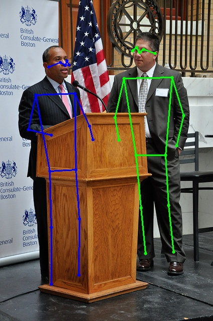
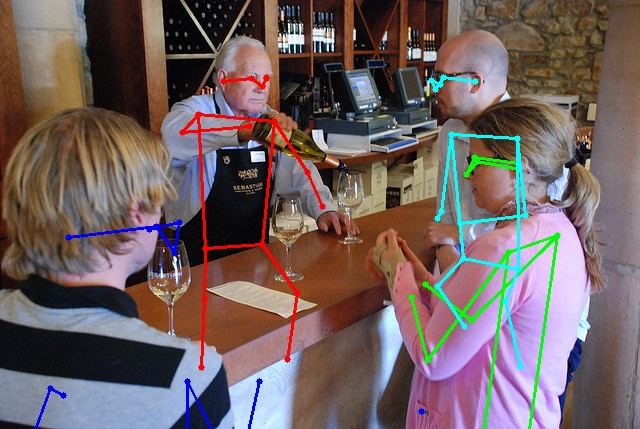
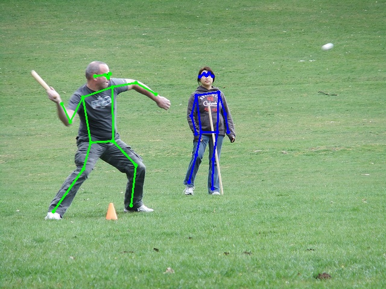

# Pose estimation with pose as compositional tokens

<div align="center">
  
  
  
</div>

## Usage
### Installation
1. Clone this repo.
2. Setup conda environment:
   ```
   conda create -n PCT python=3.8 -y
   conda activate PCT
   pip install -r requirements.txt
   ```

### Data Preparation

To obtain the COCO dataset, you can download it by running the download_data.py file or it can be downloaded from the [COCO download](http://cocodataset.org/#download), and specifically the 2017 train/val files are required. Additionally, the person detection results can be acquired from the [HRNet](https://github.com/leoxiaobin/deep-high-resolution-net.pytorch) repository. The resulting data directory should look like this:

    ${POSE_ROOT}
    |-- data
    `-- |-- coco
        `-- |-- annotations
            |   |-- person_keypoints_train2017.json
            |   `-- person_keypoints_val2017.json
            |-- person_detection_results
            |   |-- COCO_val2017_detections_AP_H_56_person.json
            |   |-- COCO_test-dev2017_detections_AP_H_609_person.json
            `-- images
                |-- train2017
                |   |-- 000000000009.jpg
                |   |-- 000000000025.jpg
                |   |-- 000000000030.jpg
                |   |-- ... 
                `-- val2017
                    |-- 000000000139.jpg
                    |-- 000000000285.jpg
                    |-- 000000000632.jpg
                    |-- ... 

### Pretrained models

To use this codebase, we provide the following models:

1. [Optional] Well-Trained Tokenizers: You can download well-trained PCT tokenizers in the [link](https://mailustceducn-my.sharepoint.com/:f:/g/personal/aa397601_mail_ustc_edu_cn/Esvcc0LSurFLjhPGRJ-ZbSAB61A1q2rFWgePjHygbdwMLA?e=pXgisB).
2. [Optional] Well-Trained Pose Models: Our well-trained PCT pose models can be found in the [link](https://mailustceducn-my.sharepoint.com/:f:/g/personal/aa397601_mail_ustc_edu_cn/Epf3xVN8lJ9Km4qGQePCKR4Bl809PZXxXJETzWz6LFuFig?e=PbG3Ps).

Your models directory should look like this:

    ${POSE_ROOT}
    |-- weights
    `-- |-- simmim
        |   `-- swin_[base/large/huge].pth
        |-- heatmap
        |   `-- swin_[base/large/huge].pth
        |-- tokenizer [Optional]
        |   `-- swin_[base/large/huge].pth
        `-- pct [Optional]
            `-- swin_[base/large/huge].pth 

### PCT

#### Stage I: Training Tokenizer

```
./tools/dist_train.sh configs/pct_[base/large/huge]_tokenizer.py 8
```
Aftering training tokenizer, you should move the well-trained tokenizer from the `work_dirs/pct_[base/large/huge]_tokenizer/epoch_50.pth` to the `weights/tokenizer/swin_[base/large/huge].pth` and then proceed to the next stage. Alternatively, you can change the config of classifier using `--cfg-options model.keypoint_head.tokenizer.ckpt=work_dirs/pct_[base/large/huge]_tokenizer/epoch_50.pth` to train the classifier.

#### Stage II: Training Classifier

```
./tools/dist_train.sh configs/pct_[base/large/huge]_classifier.py 8
```

Finally, you can test your model using the script below.
```
./tools/dist_test.sh configs/pct_[base/large/huge]_classifier.py work_dirs/pct_[base/large/huge]_classifier/epoch_210.pth 8 --cfg-options data.test.data_cfg.use_gt_bbox=False
```

#### Demo

You need to download yolo model to use as detector and then run the test.py file to generate image demo.


